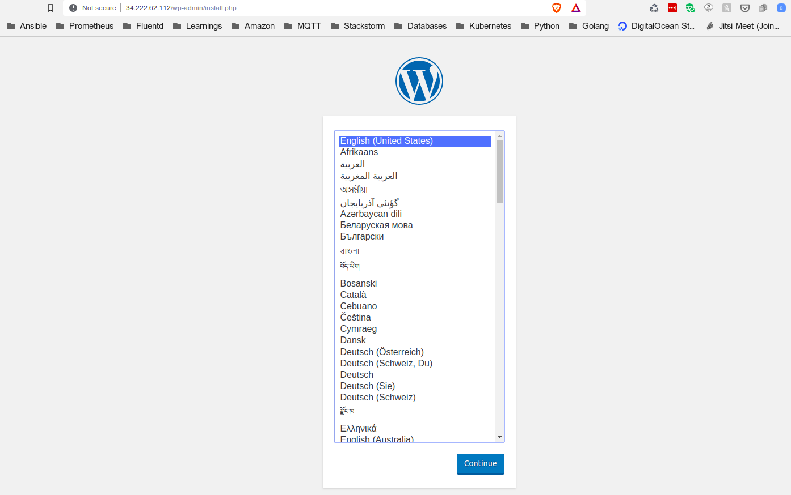

# wordpress-terraform-deployment
Deploys WordPress on EC2 instance with RDS server.

## Pre-Requisites

Install [Terraform](https://www.terraform.io/) and make sure it's on your `PATH`, however the current script was created on below terraform version:

```
Terraform v0.11.13
```

## Introduction

Uses terraform to deploy wordpress on EC2 instance with AWS RDS.

Following resources are created :
1. AWS VPC.
2. AWS Subnet for VPC.
3. AWS Internet Gateway.
4. Route table entry and associations.
5. Security Group exposing Port 22, 80 & 3306.
6. A RDS instance created with database for WordPress.
7. An AWS EC2 Instance.
8. Remote provisioner to download, install and configure wordpress docker container after EC2 deployment. 

## Running it Manually

1. Sign up for [AWS](https://aws.amazon.com/).
2. Configure your AWS credentials using one of the [supported methods for AWS CLI tools](https://docs.aws.amazon.com/cli/latest/userguide/cli-chap-getting-started.html), such as setting the
   `AWS_ACCESS_KEY_ID` and `AWS_SECRET_ACCESS_KEY` environment variables. If you're using the `~/.aws/config` file for profiles then export `AWS_SDK_LOAD_CONFIG` as "True".
3. Install [Terraform](https://www.terraform.io/) and make sure it's on your `PATH`.
4. Run `terraform init`.
5. Run `terraform apply`.
6. When you're done, run `terraform destroy`.


After Complete Run it will Output the PublicIP of your WordPress EC2 Instance. Enter http://<i>ec2-public-ip</i> to get the default WordPress login page.




## Disclaimer!!

This example deploy real resources into your AWS account which can cost you money. The resources are all part of the <b>AWS Free Tier</b>, you are completely responsible for all AWS charges.
